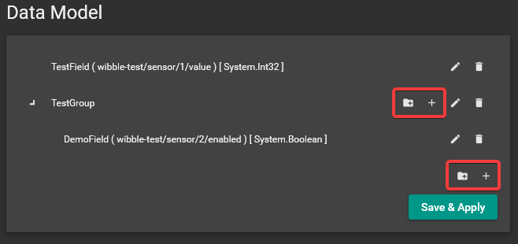

# MQTT Plugin

This plugin adds a customisable data model expansion for use with an MQTT server.

Each data model value can be bound to a specific MQTT topic, and when a message is received on that topic the relevant data model property is attempted to be set to that value.

## Usage

**Note that this plugin is currently still a work in progress and may change drastically in future revisions.**

In the plugin settings (which can be found in Artemis by going to *Settings* -> *Plugins* -> *MQTT data model expansion*), first fill out the details of the MQTT server you wish to connect to. You will need to fill in the URL, port and client ID fields as a minimum.

Next, you need to create the data model as it will appear in Artemis. There are two types of 'node' in the editor: groups and values. A group is simply a collection of any number of other groups or values. A value is what will actually receive and store MQTT data.

To add a group or value, click on either the folder plus or the plus buttons respectively. These buttons can be found next to the edit/delete buttons for a group and at the bottom of the list (for top-level nodes).

When creating a group, you will be asked to input a label. This is the label as it will appear in the Artemis data model and has no effect on anything relating to MQTT.

When creating a value, you will be asked for a label, topic, type and whether to create a change event. Again, the label is only for how it will appear in Artemis. The topic value however, determines which MQTT topic the value will be bound to. For example, entering `sensors/1/value` would mean that whenever a MQTT message is received that has a topic of `sensors/1/value`, the value of this data model property would be set to the value in the incoming message. Type refers to the type of data that the property can hold. If the incoming message cannot be converted to that type, it will be ignored. If selected, the option to generate an event will create a data model event that will fire whenever the property value is changed (does not fire if the same value is received multiple times in a row).

Once you have set your data model how you like it, click the 'Save & Apply' button. This will update the data model in Artemis.

You can then bind your layer properties or display conditions to these data model properties as you would with any other module.

## Future Plans
- TLS/SSL authentication
- Support more complex data types
- Support for JSON-encoded data that can set multiple data model properties
- Multiple MQTT servers
